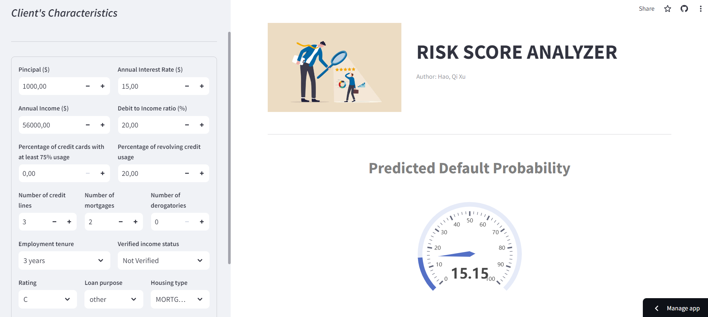
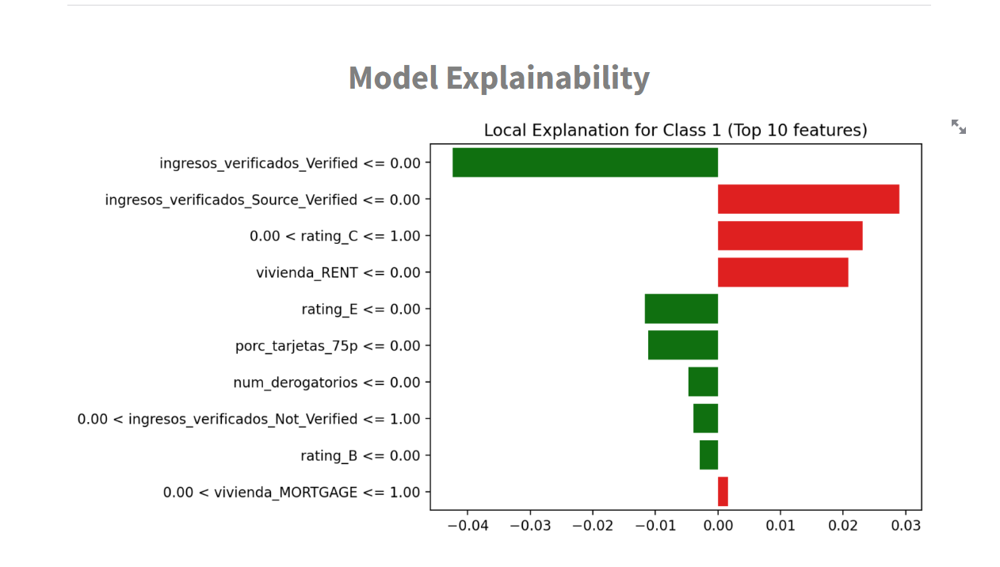
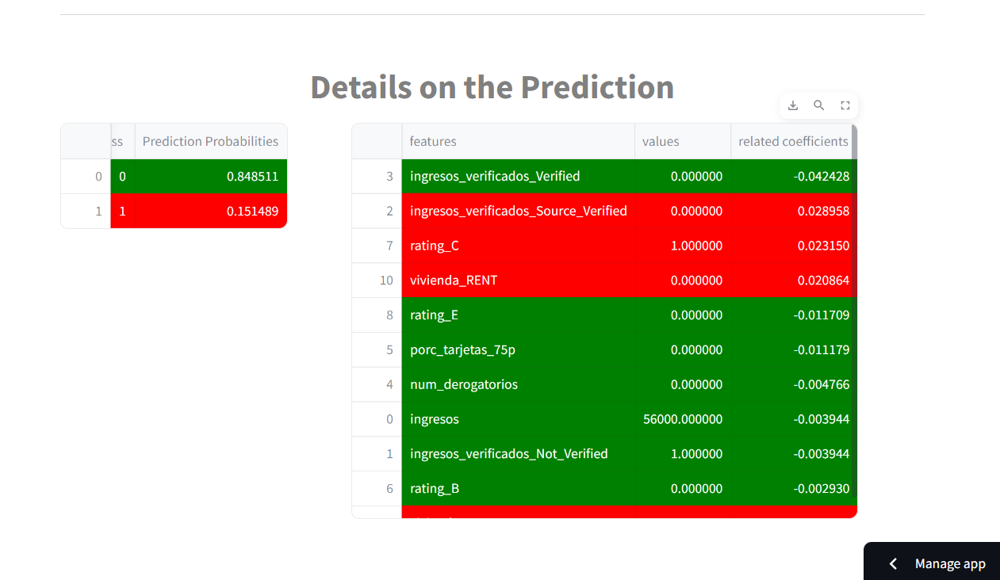

# Description
- **Credit Risk Analyzer is a web app created using Streamlit that calculates credit default probabilities**. It is based on the `CreditRisk project`, and the machine learning model integrated into the web app was developed as part of that project.
  
  - Check out the CreditRisk project repo: [[Link]](https://github.com/Haoqi9/Personal_Projects/tree/master/CreditRisk)

# Access to Web App
👉 [Click here to access web app](https://creditriskwebappst-lmmesu5xdk4m45fu9icbmf.streamlit.app/)  
- NOTE: This app **goes into sleep mode if it's been idle for 7 days**. If this is the case, feel free to reach out to me via email (kamitttt98@gmail.com) so I can get it back up and running!

- **Alternatively, you can clone this repository to your local machine**, set the folder as your working directory in the conda terminal, ensure you have installed the modules listed in the `requirements.txt file`, and then run the command `streamlit run DefaultRisk_Analyzer.py`.

# What you can find in the Web App

